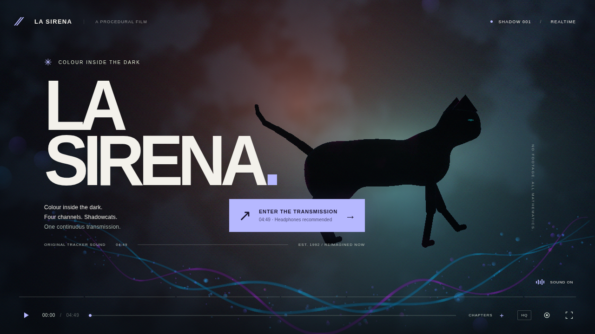

# LA SIRENA

A 4:49 music film rendered live in WebGL 2. Procedural worlds and shadowcats,
synchronized to the original tracker module.

[Watch in your browser](https://iskamag.github.io/la-sirena/)



## Run

Node.js 22.12+ and a WebGL 2 browser.

```sh
npm ci
npm run dev
```

Open http://localhost:5173. The song is included.

Space: play/pause · Arrows: seek · F: fullscreen · M: mute · C: chapters ·
V: soften motion · R: record WebM.

## Build

```sh
npm run build
npm run preview
```

Deploy `dist/` to a static host. For GitHub Pages, select **GitHub Actions**
in Settings → Pages, then run **Deploy film to GitHub Pages**.

[Video export](docs/EXPORTING.md) · [Film and score](docs/FILM.md)

## Credits

Music: **la sirena**, from [The Mod Archive](https://modarchive.org/index.php?request=view_by_moduleid&query=111386).
The original module is included as [song.mod](song.mod).

Code: [MIT](LICENSE). Music: [separate license](THIRD_PARTY.md).
